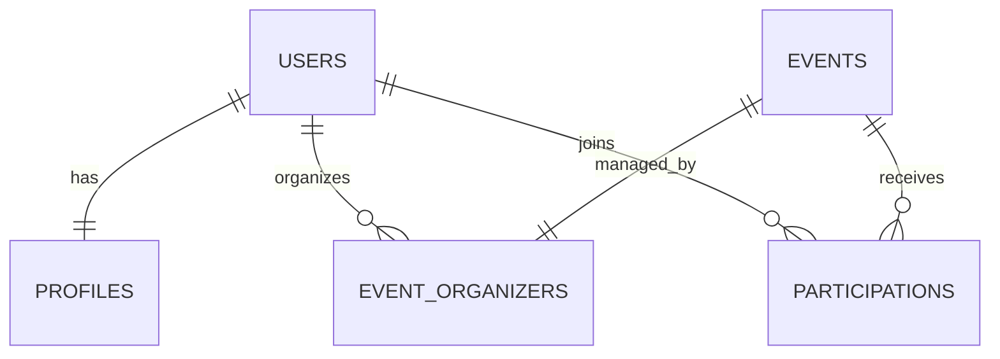

# ConnectMe Backend

ConnectMe Backend is the core API service for the ConnectMe application, built with Laravel 13 and PostgreSQL. It provides a secure, scalable, and high-performance backend infrastructure for user authentication, profile management, event/activity management, and participation tracking.

Designed for scalability, developer productivity, and clean architecture, the project utilizes modern tools like Pest PHP for testing, Laravel Pint for styling enforcement, and Laravel Boost for advanced AI-assisted development.

---

## 🛠️ Technology Stack

| Component | Technology | Version / Details |
| :--- | :--- | :--- |
| **Language** | PHP | `^8.3` |
| **Framework** | Laravel | `^13.8` |
| **Database** | PostgreSQL | `^15.0+` (Configured via `pgsql` driver) |
| **Testing** | Pest PHP | `^4.7` |
| **Code Styling** | Laravel Pint | `^1.27` |
| **Dev Utilities** | Laravel Boost, Pail | Boost `^2.2`, Pail `^1.2.5` |
| **Package Manager** | Composer & NPM | Composer v2, Node/NPM v18+ |

---

## 📂 Project Architecture

The application follows standard Laravel conventions, enforcing separation of concerns across clean architecture layers.

```
connectme-backend/
├── app/
│   ├── Http/
│   │   ├── Controllers/    # Receives HTTP requests, coordinates domain logic, returns responses
│   │   ├── Middleware/     # Request filtering (auth, logging, rate limiting)
│   │   └── Requests/       # Form requests handling input validation rules
│   ├── Models/             # Eloquent models mapping database tables to objects
│   └── Providers/          # Registers services and configures system bindings
├── bootstrap/              # App bootstrap and initialization files
├── config/                 # Application configuration files (database, cache, etc.)
├── database/
│   ├── factories/          # Model factories for seeding and testing
│   ├── migrations/         # Database schema migrations
│   └── seeders/            # Database seed scripts for development data
├── routes/
│   ├── api.php             # RESTful API routes (to be registered)
│   ├── web.php             # Core web/fallback routes
│   └── console.php         # Artisan command declarations
├── tests/                  # Automated test suite (Pest)
└── composer.json           # Application dependencies and scripts
```

### Flow of Execution
1. **Routing**: Incoming HTTP requests are matched via routes defined in `routes/`.
2. **Validation**: Requests undergo validation using `FormRequests` before reaching controllers.
3. **Controller**: Handles basic flow control and delegates heavy logic to models or custom service classes.
4. **Eloquent Model**: Interacts with the PostgreSQL database, expressing relationships and business-specific attributes.
5. **Response**: Outputs standard JSON payloads via Eloquent API Resources.

---

## 💾 Database Design

The project uses **PostgreSQL** as its primary data store. The database schema is defined incrementally through Laravel's migration system.

### Current Database Schema (Core Bootstrap)
- `users`: Stores user identity, authentication credentials, and email verification status.
- `cache` / `cache_locks`: Built-in database driver configuration for fast temporary key-value storage.
- `jobs` / `job_batches` / `failed_jobs`: Table structures supporting background queues and asynchronous tasks.

### Planned Entities & Relationships (MVP Roadmap)


*Note: The core tables (`profiles`, `events`, `participations`) are defined in the roadmap and will be scaffolded in upcoming development iterations.*

---

## 🚀 Installation and Setup Guide

Follow these steps to set up the development environment locally.

### Prerequisites
Ensure you have the following installed on your system:
- **PHP** `^8.3` (or higher)
- **Composer** `^2.2`
- **PostgreSQL**
- **Node.js** & **NPM** (v18+)

### Installation Steps

1. **Clone the Repository:**
   ```bash
   git clone <repository-url>
   cd connectme-backend
   ```

2. **Run the Setup Script:**
   The repository includes a pre-configured composer script to bootstrap the application (installs PHP & JS dependencies, creates `.env`, generates the application key, and runs migrations):
   ```bash
   composer run setup
   ```
   *Alternative manual steps if script fails:*
   ```bash
   # Install PHP dependencies
   composer install
   
   # Copy environment file
   cp .env.example .env
   
   # Generate application key
   php artisan key:generate
   
   # Install Node packages
   npm install
   ```

3. **Configure Environment Variables:**
   Open `.env` and set up your PostgreSQL connection:
   ```env
   DB_CONNECTION=pgsql
   DB_HOST=127.0.0.1
   DB_PORT=5432
   DB_DATABASE=connectme
   DB_USERNAME=your_postgres_username
   DB_PASSWORD=your_postgres_password
   ```

4. **Run Migrations:**
   Run migrations to set up the default database schemas:
   ```bash
   php artisan migrate
   ```

5. **Start the Development Servers:**
   Start the Laravel server, background queue listener, and Vite dev server concurrently:
   ```bash
   composer run dev
   ```
   Or run the server individually:
   ```bash
   php artisan serve
   ```

---

## ⚙️ Environment Configuration

The following variables in the `.env` file must be verified:

| Variable | Description | Recommended (Local) |
| :--- | :--- | :--- |
| `APP_NAME` | Name of the application | `ConnectMe Backend` |
| `APP_ENV` | Current runtime environment | `local` |
| `APP_DEBUG` | Enable debug logs & detailed error views | `true` |
| `APP_URL` | Base URL of the API | `http://localhost:8000` |
| `DB_CONNECTION` | Database driver | `pgsql` |
| `DB_DATABASE` | Target database name | `connectme` |
| `SESSION_DRIVER` | Active session store | `database` |
| `QUEUE_CONNECTION` | Queue driver for jobs | `database` |

---

## 🔐 Authentication System (Planned)

The authentication system will follow standard RESTful best practices:
- **Flow**: User registers/logs in via JSON endpoints, returning a secure session or bearer token (using Laravel Breeze or Laravel Sanctum).
- **Token/Session Handling**: Stateless API authentication with revocation capabilities.
- **Verification**: Email/phone verification processes to ensure integrity of user registrations.
- **Security Practices**: Password hashing with Bcrypt (rounds: 12), rate-limiting, protection against CSRF, and SQL injection.

---

## 📡 API Documentation (Planned)

All API endpoints will reside under the `/api/` prefix.

### Expected Endpoint Structure

| Method | Endpoint | Description | Auth Required | Status |
| :--- | :--- | :--- | :---: | :--- |
| **POST** | `/api/register` | Register a new user profile | No | 📝 Planned |
| **POST** | `/api/login` | Login and acquire token | No | 📝 Planned |
| **POST** | `/api/logout` | Revoke active token/session | Yes | 📝 Planned |
| **GET** | `/api/profile` | Retrieve active user profile details | Yes | 📝 Planned |
| **PUT** | `/api/profile` | Update profile information | Yes | 📝 Planned |
| **GET** | `/api/events` | List all activities / events | Yes | 📝 Planned |
| **POST** | `/api/events` | Create a new activity | Yes | 📝 Planned |
| **POST** | `/api/events/{id}/join` | Join / register interest in an event | Yes | 📝 Planned |

*Detailed request/response documentation (Swagger/OpenAPI or Postman Collection) will be provided here as endpoints are implemented.*

---

## 🔄 Development Workflow

Follow these rules and conventions during active development.

### Database Updates
When changing the database structure, always write migrations instead of direct SQL manipulation.
```bash
# Create a new migration file
php artisan make:migration create_xxx_table

# Run pending migrations
php artisan migrate
```

### Running Tests
This project uses **Pest PHP** for modern, readable tests. Write feature tests for all new endpoints.
```bash
# Run tests
php artisan test
```

### Code Formatting
Ensure all PHP code conforms to the application styling rules using **Laravel Pint**:
```bash
# Formats all dirty/modified files
vendor/bin/pint --dirty --format agent
```

---

## 🗺️ Future Roadmap

- [ ] **Phase 1: Authentication & Core Setup** (Laravel Sanctum/Breeze API, User signup/login, profiles)
- [ ] **Phase 2: Events & Activities** (CRUD endpoints for events, category filtering, search)
- [ ] **Phase 3: Participation Tracker** (RSVP flow, notifications, seat limits)
- [ ] **Phase 4: Optimization & Scalability** (Database indexing, API response caching, query optimization)

---

## 🤝 Contribution Guidelines

We welcome contributions to the ConnectMe backend! To ensure quality and consistency:
1. Fork the repository and create your branch from `main`.
2. Write clean code conforming to the PSR-12 standard and run `vendor/bin/pint` before committing.
3. Write Pest feature tests for any new features or bug fixes.
4. Ensure all tests pass (`php artisan test`).
5. Open a Pull Request with a clear description of your changes.

---

## 📄 License

This project is open-sourced software licensed under the [MIT License](LICENSE).
